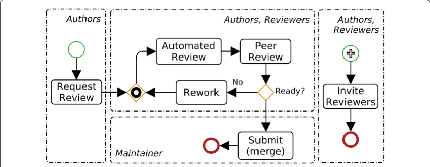

# Introduction

In order to work properly and properly organize a development project, it is advisable to follow several methods.

Below, we will explain the do's and don'ts to follow in order to carry out a project in good conditions. These are tips, it's up to you to find what works best for you.

* [Task Estimation](Task-estimation)

The "Task Estimation" section will explain what a project is, what a task is and how to estimate it. We will also talk about the "SCRUM" method.

* [Coding Standards](Coding-standards)

The "Coding Standard" section will explain what coding style is through several examples and will also show you several computer language conventions.

* [Code Reviews](Code-reviews)

And finally, the "Code Reviews" section will tell you about peer programming, the different ways to do a code review and the importance of team spirit and communication within an organization.


# Task estimation

### Project estimation

**What's a project ?**

A project is defined by "an individual or collaborative enterprise that is carefully planned to achieve a particular aim".

Before defining a task, we need to define the overall project. That is, we need to think about several points that will help us to better define later the project tasks and their estimation.

The subject must be clarified to avoid confusion and misunderstanding during the project development. To ensure the project is understood by the whole team, meetings must be organized frequently during which:

- [ ] Requirements should be defined or redefined
- [ ] Long-term, mid-term and short-term objectives are then defined or redefined
- [ ] In some case, a new specific feature asked by the client may be defined
- [ ] All the tasks that need to be done are defined
- [ ] Team members that will be involved
- [ ] Project deadline might be defined

The above points are essential to plan the project the best we can. It will be important to repeat as much as possible this kind of meeting to ensure the project is going well over the time. Doing frequently meetings allow the whole team to be aware of the project advancement, if there is something new or an issue that must be treated in urge. It's also a way to ensure that everyone is working efficiently on the project priorities.

---

### Task estimation

**What's a task ?**

A task is defined by "a piece of work to be done or undertaken". So, in software progamming for example, a task could be a feature, a code review as well as writting documentation or resolving an issue.

**How to estimate a task ?**

As seen before with project estimation, several steps are needed to correctly and efficiently estimate a task duration. Some of these are also applicable to the task scope.
We will need to estimate not only the time we will need to accomplish the task but also many other things like human resources needed to handle the task, infrastructure cost, meetings needed to follow the task advancement, code reviews and many more.

**Task estimation cons and pros**

When talking about project or task estimation we obviously think about how the estimations will help the team to work efficiently and gain time on a project. But most of the time we don't take into account that taking too much time on estimations is also a lost of time in the sense that estimating could save us time thanks to a better organization but it's only worth if it's frequently done with short estimation and relatively quick decisions.

[Read more about project and task estimation](https://medium.com/globalluxsoft/time-estimation-in-software-development-a4a495c8eb6c)

---

### SCRUM method

**What's SCRUM method ?**

Scrum is an agile method dedicated to "project management". This management method, or rather this Project Management Framework, aims to improve the productivity of your team.
This method includes several roles that the whole team must play and it's very helpful to the task estimation.

**SCRUM method roles**

  

**SCRUM Master**

The Scrum Master is first and foremost a member of the project team, he is not a superior but rather a coach, these main tasks are listed below:

- Ensures that Scrum's principles and values are respected.
- Facilitates communication within the team.
- Seeks to improve the productivity and know-how of his team.

**The team**

The team is the heart of the SCRUM method, without a team, no work done, it seems logical. They do not have defined roles, it will mostly depend on the type of project. 
Here are the main characteristics of a team:

- No definite role: architect, developer, tester.
- All team members bring their know-how to accomplish the tasks.
- Sizes from 6 to 10 people in general and up to 200 people in particular.

**Product Owner**

Within a Scrum team, the Product Owner makes the link between the business part and the technical part of the project, here are his main objectives: 

- Business expert, defines functional specifications
- Prioritizes the features to be developed or corrected
- Validates the developed functionalities
- Plays the role of the customer

**Sprints**

The Scrum life cycle is punctuated by iterations of a few weeks, the sprints.
The duration of a sprint is generally between 5 days to 2 weeks.

**Product backlog**

The initial requirements repository is established and prioritized with the customer. It constitutes what is known as the product backlog. It does not necessarily have to contain all the functionalities expected from the beginning of the project, it will evolve during the project in parallel with the customer's needs.

**User Story**

The features described are called User Stories and are described using the terminology used by the client.

A User Story or Story usually contains the following information :

- [ID] a unique identifier
- [Name] a short name (between 2 and 10 words), describing the functionality expected by the customer (e.g. Export / Import Standard Sales Item). The name should be clear enough for team members and the Product Owner to understand what the function is. The name must not introduce ambiguities.
- [Importance] an integer that sets the priority of the Stories. The priority of a story can be changed during the course of the project.
- [Estimate] The amount of work required to develop, test, and validate this functionality. The unit of measure can be an ideal number of days (days 100% dedicated to the functionality) or a number of points. Estimates are made on a relative basis by comparing the estimates of completed stories with the story to be estimated.
- [Demo] A relatively simple test (e.g. export an object in XML then delete it from the database, import it from XML, at the end the object must be in the database). This test is a validation test.
- [Notes] any other information: clarifications, documentary references

**Sprint planning meeting**

Before each sprint, we organize a planning meeting, the sprint planning meeting. This planning meeting selects from the product backlog the most priority requirements for the customer. They will be developed, tested and delivered to the customer at the end of the sprint. They constitute the sprint backlog, a sub-set of the product backlog.

**The scrimmage**

During the sprint, a progress meeting (about 15 min) is held every day with all team members to ensure that the sprint objectives will be met, this is the Scrum. Each day, after the Scrum meeting, the Scrum Master maintains a chart called the sprint burndown chart. This chart gives a very good view of what has been done and the pace of the team's work. It also makes it possible to anticipate whether all the stories in the Sprint Backlog will be completed at the end of the iteration or not.

This meeting has not only a purely informative purpose, but also to stimulate the team spirit and the level of commitment of each team member to the project. During the meeting each team member should speak and present mainly the following things:

- What I did yesterday and any problems I encountered...
- What I'm going to do today
- Am I having difficulty continuing my work.
- By doing this exercise daily each team member is aware of what his or her colleagues are doing and can coordinate their work and help or be helped in case of difficulties.

The Scrum Meeting is not a meeting in which problems are solved, but only identified and expressed. The role of the Scrum Master is to provide solutions or to delegate to another team member the resolution of problems raised during the Scrum Meeting. Following this meeting, the Scrum Master updates the burndown chart.
At the end of a sprint, the client is given a demonstration of the latest developments, the Sprint Review Meeting. It is also an opportunity to make a review of the team's performance and to find points for improvement.

Because of its values, Scrum advocates adaptability, under the effect of the experience acquired and the specificities of the project, which brings it closer to the Toyota production method. Visibility, to evaluate the results of the process. Inspection, to verify deviations from the initial objective.

[Read more about SCRUM Method](https://en.wikipedia.org/wiki/Scrum_(software_development))


# Coding standards

To begin, in order for the working group to be effective and coordinated, members need to put themselves agree on several points:
### Naming Convention

A naming convention in programming is a set of rules and coding standards for choosing the rules that will make up our source code, file identifiers and documentation. The goal is to make source code easier to read with less understanding effort to do (as if we were talking the same language and which we did not need to translate in our head). It also improves the appearance code, to avoid names that are too long or abbreviations and name identifiers that would not be understandable only by for the author of the code.

Each convention has its advantages and disadvantages depending on the languages, and each person can have their preferences. So, it is very important that the group that will work together on the same project meet upstream of the project to agree on these rules to be established. It is also necessary that the potentials groups that will work together are aware of these conventions chosen to respect them or, at least, understand code more easily when they need to read or work on it.

For example, there are several typographic standards for naming variables:
* variable_name in snake case (used in PHP, Ruby or Python)
* variableName in camelCase (found mainly in JavaScript, Java, C ++ or C #)
* VariableName in PascalCase (often used to name classes in PHP)
* variable-name in kebab-case (generally used in URLs)

[Read more](https://medium.com/better-programming/string-case-styles-camel-pascal-snake-and-kebab-case-981407998841)

These same conventions can be used to define function names or file names.

However, beware, these naming rules don't stop you from thinking. So you have to take an account other elements taken into account such as:

The meaning of the name of the variable we are going to name. It has to make sense for the oncomprehend its meaning in function.

If my function is written like this:
```
if (idx < 18) {
    var = var + 1;
    return false;
} else {
    return true;  
}
```
Or like this:
```
if (age < 18) {
    year = year + 1;
    return false;
} else {
    return true;
}
```
The last is more meaningful and is more comprehensive thanks to the name and its easily identifiable role from the first reading. The same must be done with the function names!

Then remember to respect these rules in a consistent way so that our reading of the code is not disturbed by changes without explanation.

Also be careful not to reuse the same variable name in the same class in different contexts, this provides more simplicity for understanding and maintainability.

Do not use a long name, it makes the code more difficult to read and can make the compilation more difficult with some compilers.

If you want other do's and don'ts to make sure you have a meaningful and meaningful code, I advise you to take a look [over here](https://dzone.com/articles/best-practices-variable-and)

---
### Coding Style

**What's coding style ?**

The coding style is a set of rules used in programming when writing source code. These rules allow to have symmetrical source codes no matter the developer and therefore a standard code readable and understandable by all. It is also a good way to avoid errors when writing code.

One of the most important things of coding style is indentation. It allows to quickly identify the different code blocks, functions and methods.

For example :
```
if (hours < 24 && minutes < 60 && seconds < 60)
    return true;
else
    return false;
```

```
if  ( hours   < 24
&& minutes < 60
&& seconds < 60)
return true;
else
return false;
```

These two blocks of code make it possible to perform exactly the same action and yet the first block is much simpler to read and it is also easier to identify the different conditions (and therefore to identify potential errors).


Another very important point is spacing. Like the indentation, it mainly allows a better reading and understanding of the code.

For example :
```
int i=0;
for(;i<10;i++){
    printf("%d",i+(i*2));
}
```


```
int i = 0;
for (; i < 10; i++) {
    printf("%d", i + (i * 2));
}
```

These two blocks of code perform exactly the same action except that the second block is much easier to read than the first.

> Be careful not to put spaces unnecessarily everywhere which can deteriorate the simplicity of reading and no longer in the language standards.

The last essential point of the coding style are the characters ```{ }``` which are used in almost all programming languages. They allow to create condition blocks or loops as seen above. These characters are also important in terms of their placement in the code.

For example :
```
if (hours < 24 && minutes < 60 && seconds < 60) {
    return true;
} else {
    return false;
}
```

```
if (hours < 24 && minutes < 60 && seconds < 60)
{
    return true;
}
else
{
    return false;
}
```
Here, reading is quite simple in both cases, but good practice in certain languages prefers to use one or the other.

In conclusion, it is important to respect the code standards provided by the different languages. When it is possible to write in different ways, development teams must choose the writing that suits them in order to have a uniform code.


---
### Languages Convention

The world of computer development is formed by many languages, frameworks and development tools. All languages have best practices and writing conventions.
It is very important to follow the conventions set up by the community of the language / framework in question. This allows a symmetry of code between all programs developed with the same language. It is also a way to read and understand anyone's code quickly.
We will see the code conventions for one programming language and one framework.
These are examples and there are conventions for all languages.

Each language has its own conventions but some are common to all languages :
* Follow the DRY Principle (Don't Repeat Yourself)
* Limit line length
* Keep the code simple


**Convention in C language**

To write code following best practices, you must first learn about naming conventions.
For example in the C language :

Variables and functions are written in [camelCase](https://en.wikipedia.org/wiki/Camel_case) :
```
int nbPeoples;
openFile();
```

In C language, the files are organized this way :
```
  /* macros ============================================================== */
  /* constants =========================================================== */
  /* types =============================================================== */
  /* structures ========================================================== */
  /* private variables =================================================== */
  /* private functions =================================================== */
  /* internal public functions =========================================== */
  /* entry points ======================================================== */
  /* public variables ==================================================== */
```

[Read more](https://www.topcoder.com/coding-best-practices/)

**Convention in Symfony Framework**

The symfony framework also follows the writing of functions, methods and variables in [camelCase](https://en.wikipedia.org/wiki/Camel_case) .

For the configuration of parameters and twig template variables, use the [snake_case](https://en.wikipedia.org/wiki/Snake_case) .

For naming PHP namespaces and classes, use the [UpperCamelCase](https://en.wikipedia.org/wiki/Camel_case) .


The naming conventions used are different depending on what is needed, which makes it possible to quickly identify variables and functions of PHP classes for example.

Here is a non-exhaustive list of Symfony conventions
* Add a single space after each comma delimiter;
* Add a single space around binary operators (==, &&, ...), with the exception of the concatenation (.) operator;
* Use ``return null;`` when a function explicitly returns null values and use ``return;`` when the function returns void values;
* Declare public methods first, then protected ones and finally private ones. The exceptions to this rule are the class constructor and the setUp() and tearDown() methods of PHPUnit tests, which must always be the first methods to increase readability;


[Read more](https://symfony.com/doc/current/contributing/code/standards.html)

---
### Comments Standards

**When should we comment?**

When the need or need comfort required so that other group members can understand easily function and functionality.

Remember that the comments are portions of the source code disregarded by the compiler or interpreter, because they are not necessary for the program to run. They are usually inserted in the code so that it is easy to understand and that it can be changed easily in the  future.

Developer tends to underestimate the benefits of commenting, but comment **!=** document.

Let us separate once and for all the expression document to comment.

Documenting means providing a description of its application, all of its public access points and dependencies.

Examples:

```
/*
    Comments
*/
```
Or:
```
// Comments
```
Or:
```
/**
* Comments
*/
```
Or again:
```
x = x + 1                 # Increment x
```

[Different way to comment](https://en.wikipedia.org/wiki/Comment_(computer_programming))

# Code reviews

### Pair programming

**What's pair programming ?**

Pair programming is a development method where two developers work on the same computer. The first, the one who writes the code is called the driver and the second, the observer, assists the driver by correcting potential errors and proposing development alternatives.

**Quality and Productivity**

Even though this practice is often abandoned by companies that think it is a waste of human resources, several studies have looked at the relative productivity of a pair of programmers versus a single programmer.
This study has proven that in terms of productivity, pair programming allows to accelerate development times especially for projects requiring a quick implementation of the solution on the market.
Pair programming allows a faster bug detection thanks to the observation of the pair programmer who realizes a code review in real time and throughout the activity. The applications created are therefore of better quality with a testing requiring less work.
The extra cost of staff (2 developers for 1) is very well compensated by the increase in development quality which allows to detect errors earlier. Indeed, the later a bug is detected, the more expensive it is to correct it.

**Communication and Team spirit**

Pair programming is a social activity that requires the ability to work in a team. It allows to develop the communication skills of the different collaborators to form a strong team spirit.
This team spirit significantly improves the well-being of the employees in their work and therefore the productivity and quality of the work provided. Indeed, many surveys have shown that more than 90% of developers prefer to program in pairs rather than alone.


**Indicators of non-performance**

Beware of non-performance indicators that can be a brake on pair programming. When training pairs, it is important to choose the employees who will work together according to the objectives of the activity.

* Silence: Pair programming requires you to program aloud and share your point of view with your partner. Persistent silence indicates a lack of collaboration.
* Disengagement: One member loses interest in the project and will go about their business.
* Deletion: When one member is more experienced than another, the novice is content to watch the expert perform the majority of the development tasks.
* Relationship problems: the two members of the pair do not get along and do not wish to work together.


Pair programming is therefore a good alternative to development alone. It allows the development of communication skills that are essential for teamwork. In companies, it is also used to quickly transfer skills.

[Read More](https://en.wikipedia.org/wiki/Pair_programming)

---

### Pull request

**What's a pull request ?**

A pull request in programming could be defined as a way to ask for a code review on a feature or a piece of code we have done and on which we want a feedback from our colleagues. It's a very useful and a common way in programming to ensure that the code is working correctly, following the coding styles and convention that have been chosen for the project and mostly that the piece of code is able to be added to the existing one without any problem.



**How to create a pull request in GitHub**

First, you need to commit and push a piece of code on the branch you are working on. This can be done either on GitHub directly, by using an IDE or even using terminal with Git command.

Then, you have to on your GitHub repository, in the pull request section.
Click on the button "New pull request", select first the branch where you want to merge the code and second, the branch from which you want to merge i.e the branch where you just pushed your code.

You will see the comparison page which draw you the differences between the two branches you are going to merge including the previous commit on the destination branch if there are already some, and the files that have been updated with their content and more.
Click on "Create pull request"

Finally, add a title to your pull request and comments if needed. Aside from this, you will be able to assign yourself and people involved if there are some, and select one or more reviewers that must approve your changes before merge.
To finalize your pull create, click on "Create pull request" or the down arrow if you want to just draft the pull request at the moment.


[Read More](https://help.github.com/en/github/collaborating-with-issues-and-pull-requests/about-pull-requests)

---

### Continuous integration

**What's continuous integration?**

Continous integration could be defined as a set of pratices in programming to ensure that the overall project is not impacted by a piece of code or changes pushed by someone from the developpers team.

**Continuous integegration goals**

The general purpose of continuous integration is to have unit tests on each part of the project that will be passed at each push on a branch to ensure that it will not "break" another part of the project. It may be used in a pull request for example, if the tests are all passed, then it can be merge if the reviewers aggreed on the code proposed. It is a way to ensure that developpers are coding something effectively by thinking about it before and not just pushing something working but mostly not adding a bug that will be issued later.

In general, it's only a part of a whole pipeline including several steps such as pull request and deployement

**Deployment pipeline**

Deployment pipeline is a very good practice but not used enough in practice in many companies not specialized in software development because it needs to allocate time to construct an effective pipeline as well as human resources and the companies give priority to the product development rather than the production pipeline.

[Read more about deployment pipeline](https://medium.com/the-making-of-whereby/what-is-a-deployment-pipeline-and-how-it-helps-software-development-teams-6cb29917ceea)

---

### Integration tools

As said above, continuous integration is an important practice in software development and nowadays there are many tools that can be used to easily setup the integration part in your project such as:

* TravisCI
* CircleCI
* Jenkins
* ...

Most of them could be easily integrated with GitHub, GitLab etc. in order to as mentionned before, create a pull request with a merge restriction until all unit tests are passing.

But, continuous integration is only a part of the pipeline, other tools are available to get more information about the code tested such as coverage tools.

[Example of integration tools](https://code-maze.com/top-8-continuous-integration-tools/)

---

### Coverage tools

As mentioned before, coverage tools are another part of a good development pipeline. To explain it in a simple way, they are tools that analyze a piece of code and determine a percentage of line covered by the unit tests we have previously setup.
The more the percentage is high the more the code is covered by these unit tests.

**How coverage is calculated**

To determine how much a code is covered by the unit tests, the coverage tools will evaluate a piece of code and all the posssibilities of running this piece of code.

```
if (age > 13) {
  return true;
} else {
  return false;
}
```

In the code above, there are only two possibilities, either you enter in the if scope, either in the else. The tool will so check if the function containing this piece of code is tested on the both cases. It means that only two unit tests are needed here to get a 100% of coverage but we could imagine a real function which contains multiple conditions or includes several calls to another functions and so to reach the 100% of coverage, much more tests will be needed.

[Example of coverage tools](https://stackify.com/code-coverage-tools/)

---

### Checklist

**The importance of checklists**

Checklists, in support of development and organization tools, are an essential tool for project monitoring and task completion. They allow you to note all the important points and discuss / carry out on the project during one day for example.

**Checklists for code reviews**

It is important to address this point in the coding review section because this tool can also be used for code reviews.
You can write down all the points to be discussed, the important things to check. Once a task is done, just check the corresponding box. It's also a tool that will free space in our memory and allow us to concentrate on the essential tasks in the work. In fact, instead of keeping in the corner of our head all the tasks we have to do, we write them down as we think about them and thus free up space in our brain to concentrate at best.

**Checklists Tools**

There are a large number of tools for making checklists called ToDoApps. On a smartphone or computer, it is up to you to choose the tool that suits you best.

Here is a non-exhaustive list of several applications:

* Any.do
* Todoist
* Microsoft To-do
* Google Task

**To go further**

It is possible with some tools like Trello or Github project to go further.
These two tools allow you to create action lists more detailed than a simple checklist. You can create lists and detail the checklist, comment on it, assign people to the task. Several other options are available that you can discover by testing the application and choose the one that suits you.
In the case of Trello and Github Project, you can also automate tasks related to git commits. For example, when the task number (which is called a ticket) is quoted in a commit, the task is checked.

### Convention Check

**What's convention check ?**

The convention checks and verifies compliance with the code standards and good practices of the languages in question.

**How to check ?**

This can be checked simply by rereading the code (it is more efficient to read another developer's code to better spot errors) or/and using automated tools called coding-style checkers. There are many of these on github for many different languages.

**Help to dev**

In order to produce clean code with development standards, you can also use tools on text editors (VScode, Atom ...) or IDE (Jetbrain ...). In all these softwares, we can install modules that allow us to correct our convention errors such as spaces, indentation or even variable declaration.

So there are different solutions to check the good respect of the standards of your code. All these solutions have been created to help the developer in his work. It's up to each one to choose the tool that suits him best
